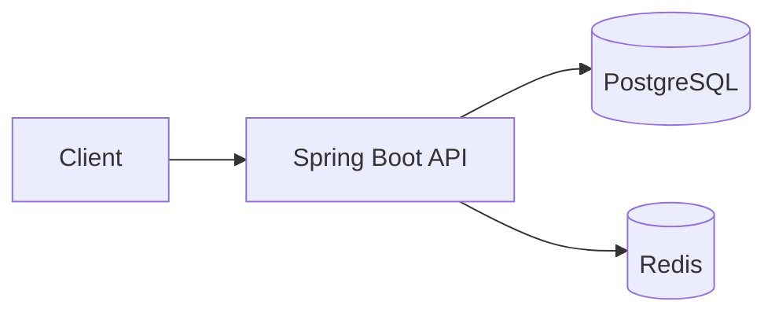
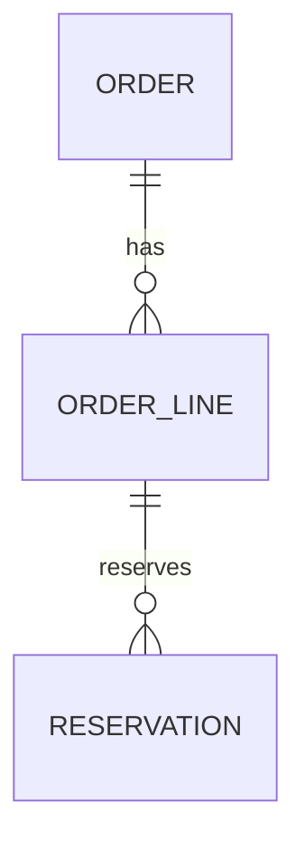
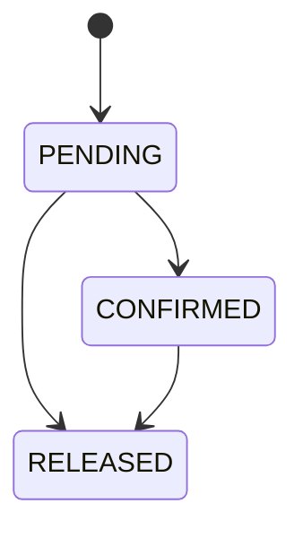

# Design Doc — `<Project> · <Milestone or Feature>`

> Reusable template. Copy into your project repo as `docs/design/<nn>-<slug>.md` **before** implementing
> a milestone. Fill in what you know; leave `?` where you don't — an honest `?` is more useful than
> a guess. Keep it to 1–3 pages. Update it when the implementation diverges (and record *why* in an ADR).

| Field | Value |
|---|---|
| Status | Draft / In review / Approved / Implemented / Superseded |
| Author | `<you>` |
| Date | `<YYYY-MM-DD>` |
| Milestone | `<M2 — Idempotent orders + concurrent reservations>` |
| GitHub milestone / issues | `<link>` |
| Related ADRs | `<ADR-003, ADR-004>` — see [decision log](#13-decision-log) |
| Spec reference | `<roadmap 18-projects/<project>/milestones.md#m2>` |

---

## 1. Context

*Why does this work exist now? What already exists (previous milestones), what is the user-visible
problem, and what constraints come from earlier decisions?*

- Current state: `<what the system does today>`
- Trigger: `<milestone requirement / bug / measurement>`
- Constraints inherited: `<e.g. Postgres 16 only; single-node Redis; no new infrastructure>`

## 2. Goals and non-goals

**Goals** (checkable — each one should map to an acceptance criterion in §4):
- [ ] `<G1: two concurrent reservations for the last unit → exactly one succeeds>`
- [ ] `<G2: repeated POST with the same Idempotency-Key returns the stored response>`

**Non-goals** (explicitly out of scope for this doc — say why, and where it goes if anywhere):
- `<Distributed locks across instances — not needed at single-node; revisit in ADVANCED tier>`
- `<Split fulfillment — ADVANCED tier, separate design doc>`

## 3. Requirements

### 3.1 Functional
| ID | Requirement | Source |
|---|---|---|
| F1 | `<The system shall …>` | `<spec §… / issue #…>` |
| F2 | | |

### 3.2 Non-functional
| ID | Requirement | How it will be verified |
|---|---|---|
| N1 | `<Reservation endpoint p95 ≤ ? ms at ? VUs on ? hardware — target, to be measured>` | `<k6 script, benchmark report>` |
| N2 | `<No lost or duplicated reservation under N concurrent requests>` | `<ReservationConcurrencyTest>` |
| N3 | `<Redis unavailable → requests still succeed via DB>` | `<failure exercise FE-3>` |

## 4. Acceptance criteria

Copy from the milestone spec, sharpen into checkable sentences, and reuse as the PR checklist.

- [ ] `<Given …, when …, then …>`
- [ ] `<Given …, when …, then …>`
- [ ] All new code covered by tests listed in §10; `mvn verify` green in CI

## 5. Architecture

*Components touched, the request/job flow, and where the new logic lives. One diagram beats a page of prose.*



- Layers affected: `<controller / service / repository / scheduler / worker>`
- New components: `<IdempotencyFilter, ReservationService, …>`
- Sequence for the main flow (numbered): 1. `<…>` 2. `<…>` 3. `<…>`
- Transaction boundaries: `<which method opens the transaction; what is outside it and why>`
- Concurrency model: `<locks / versions / queues / single-writer — and why>`

## 6. Data model

*Tables/entities added or changed, constraints, indexes, migrations.*



| Table / entity | Change | Constraints & indexes | Migration |
|---|---|---|---|
| `<reservation>` | new | `<UNIQUE(order_line_id, warehouse_id); CHECK(quantity > 0); FK …>` | `V5__reservations.sql` |
| `<idempotency_key>` | new | `<PK(key, user_id); expires_at index>` | `V6__idempotency.sql` |

Invariants the schema must enforce (not just the code): `<available = on_hand − reserved − allocated ≥ 0>`

## 7. API

*Endpoints added or changed. Link to the OpenAPI spec once generated; here list the contract.*

| Method | Path | Auth / role | Request | Responses | Notes |
|---|---|---|---|---|---|
| `POST` | `/api/v1/orders` | `OPS_MANAGER` | `<CreateOrderRequest>` + `Idempotency-Key` header | `201` / `200` (replay) / `409` (key reuse, different body) / `422` | ProblemDetail errors |

- Error format: RFC 9457 `application/problem+json` via `ProblemDetail`
- Pagination / filtering: `<page, size, sort; cursor for history>`
- Idempotency semantics: `<what is stored, TTL, conflict rule>`
- Versioning: `<URL prefix /v1>`

## 8. State machines

*Every entity with a lifecycle gets a table of legal transitions; tests assert the illegal ones are rejected.*

| Entity | From | Event | To | Side effects |
|---|---|---|---|---|
| `<Reservation>` | `PENDING` | confirm | `CONFIRMED` | `<decrement available>` |
| `<Reservation>` | `PENDING` / `CONFIRMED` | cancel | `RELEASED` | `<increment available>` |
| `<Reservation>` | `RELEASED` | any | — | **rejected** (`409`) |



## 9. Failure modes

*What can go wrong, what the user sees, how the system behaves, and which failure-engineering exercise covers it.*

| # | Failure | Detection | Behaviour | Recovery | Exercise / test |
|---|---|---|---|---|---|
| 1 | `<DB connection lost mid-transaction>` | `<exception>` | `<rollback; 503 with Retry-After>` | `<client retries with same Idempotency-Key>` | `<FE-2>` |
| 2 | `<Redis down>` | `<connection timeout>` | `<cache bypass; log at WARN once per minute>` | `<auto when Redis returns>` | `<FE-3>` |
| 3 | `<Two requests, same key, different body>` | `<fingerprint mismatch>` | `<409 ProblemDetail>` | — | `<IdempotencyConflictTest>` |
| 4 | `<Process crash between step A and B>` | — | `<state: …>` | `<retry converges because …>` | `<CrashBetweenStepsTest>` |

## 10. Security

- AuthN/AuthZ for new endpoints: `<roles; method security>`
- Input validation: `<Bean Validation constraints; size limits>`
- Secrets / keys touched: `<none / SDK keys hashed at rest / webhook secret from env>`
- Abuse cases: `<replay, enumeration, oversized payloads, rate limits>`
- Data exposure: `<what is logged; PII in logs?>`
- Specific risks: `<e.g. Docker socket exposure; HMAC comparison must be constant-time>`

## 11. Testing plan

| Layer | Tests (names) | Proves |
|---|---|---|
| Unit | `<AllocationScorerTest>` | `<deterministic scoring, tie-break by id>` |
| Slice | `<OrderControllerWebMvcTest>` | `<validation, ProblemDetail shape, auth>` |
| Integration (Testcontainers) | `<ReservationConcurrencyTest>` | `<N threads, 1 unit → exactly one success>` |
| Failure / chaos | `<RedisDownDegradesToDbTest>` | `<§9 row 2>` |
| Performance | `<k6 create-order.js>` | `<N1 — reported via benchmark template>` |

Short skeleton of the key test (optional, ≤ 25 lines):

```java
@Test
void onlyOneOfNConcurrentReservationsSucceedsForLastUnit() throws Exception {
    // arrange: sku with available = 1; N = 20 threads; CountDownLatch to start together
    // act: each thread calls reservationService.reserve(skuId, warehouseId, 1)
    // assert: successes == 1; failures == N - 1; inventory.available == 0
}
```

## 12. Rollout / deploy

- Migrations: `<Flyway versions; backward compatible? reversible?>`
- Config / env vars added: `<IDEMPOTENCY_TTL_SECONDS, …>` → update `.env.example` and DEPLOYMENT.md
- Feature flag / kill switch: `<if any>`
- Deployment steps: `<image build → GHCR → EC2 pull → compose up -d>`; downtime expected: `<none / seconds>`
- Observability: `<log lines / metrics / CloudWatch alarm to add>`
- Rollback plan: `<previous image tag; migration compatibility>`

## 13. Open questions

| # | Question | Owner | Resolve by | Answer |
|---|---|---|---|---|
| 1 | `<FOR UPDATE vs @Version — measure both?>` | me | `<before PR #12>` | `<→ ADR-004>` |
| 2 | | | | |

## 14. Decision log

Decisions made while writing or implementing this doc live as ADRs in `docs/adr/` using the
[ADR template](./adr.md), indexed in `docs/DESIGN_DECISIONS.md`.

| ADR | Title | Status |
|---|---|---|
| `ADR-00x` | `<Pessimistic locking for reservations>` | Accepted |
