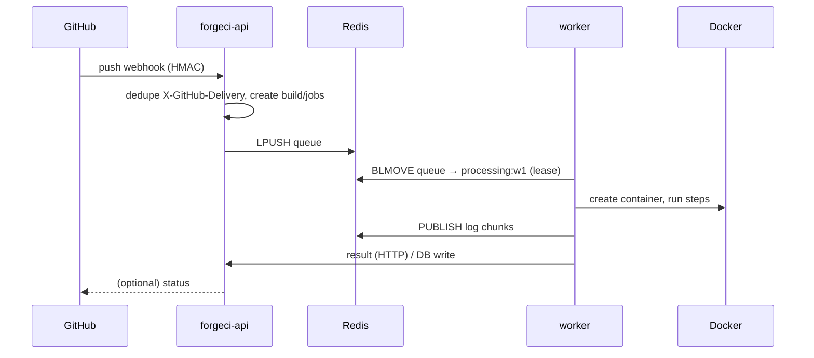

# Week 25 — Polish II: performance, load tests, diagrams, demos

[← Week 24](../week-24/) · [Roadmap](../../ROADMAP.md) · [Week 26 →](../week-26/)

**Phase 5 · Polish & interviews** (weeks 24–26)

| Block | Hours | Focus |
|---|---:|---|
| Project | 20 | k6/JMH runs recorded with methodology, `PERFORMANCE.md` per project, ERDs, architecture diagrams, screenshots/demos, GitHub issues/milestones cleanup; Python tools' docs finalised |
| Learning | 3 | Load-testing methodology, profiling basics, diagramming |
| DSA (Python) | 6 | Weakest patterns — **5 new** + reviews + 1 Java rep |
| Interview / review | 16 | **2 mocks (Track A + B), 2 OA sims, one full loop**, applications at volume |

---

## 1. Main objective

Produce the **numbers and pictures** that turn "I built four systems" into evidence: a
`PERFORMANCE.md` per project with methodology, environment and percentiles; an ERD and an
architecture diagram per project; a 60–90-second demo (GIF or short video) per project; clean
issue trackers. Everything measured this week feeds next week's résumé bullets — nothing
unmeasured is allowed there.

## 2. Prerequisites

- Polish I done ([Week 24](../week-24/)): bugs fixed, security tables, docs readable, Python components in CI.
- Existing baselines: FlowGrid k6 ([Week 8](../week-08/)), LedgerX throughput ([Week 12](../week-12/)), ForgeCI queue benchmark via `loadsim` ([Week 18](../week-18/)), FlagForge p99 + propagation ([Week 21](../week-21/), [Week 23](../week-23/)).
- Template: [`18-projects/templates/benchmark-report.md`](../../18-projects/templates/benchmark-report.md).

## 3. Learning topics

| Topic | Subtopics | Read |
|---|---|---|
| Load-testing methodology | Define the question first; open vs closed workload models; warm-up; steady state; duration; percentiles not means; coordinated omission; repeat runs and report variance; environment sheet | [`18-projects/templates/benchmark-report.md`](../../18-projects/templates/benchmark-report.md), [`15-system-design/scalability.md`](../../15-system-design/scalability.md) |
| Profiling basics | JFR (`-XX:StartFlightRecording`) + JDK Mission Control, async-profiler awareness, `EXPLAIN (ANALYZE, BUFFERS)` for the top 3 queries, `redis-cli --latency`, connection-pool saturation (HikariCP metrics via Actuator) | [`01-java/06-memory-jvm.md`](../../01-java/06-memory-jvm.md), [`04-sql-databases/05-indexes-performance.md`](../../04-sql-databases/05-indexes-performance.md), [`05-spring-boot/06-logging-actuator.md`](../../05-spring-boot/06-logging-actuator.md) |
| Diagramming | C4-style context + container diagrams, sequence diagram for the one critical flow, ERD conventions (crow's foot, PK/FK, invariants noted), Mermaid in Markdown vs exported PNG | [`18-projects/templates/design-doc.md`](../../18-projects/templates/design-doc.md), [`04-sql-databases/04-schema-design.md`](../../04-sql-databases/04-schema-design.md) |
| Python for analysis | Reading k6 JSON/CSV summaries with `csv`/`json`, `statistics`, producing the Markdown table for `PERFORMANCE.md` with a small script (checked in under `tools/`), matplotlib optional | [`19-python/04-testing-and-scripting.md`](../../19-python/04-testing-and-scripting.md) |

## 4. Concepts to learn

### 4.1 A benchmark is a question with a recorded method

Fill the template for every run: **question** ("what is p99 order-creation latency at 50 concurrent users with 1 warehouse and 10 000 SKUs?"), **environment** (machine/instance type, JVM, DB location, Redis location, versions), **workload model** (VUs or arrival rate, think time, duration, warm-up), **results** (p50/p95/p99, throughput, error rate, 3 runs), **observations** (bottleneck, evidence: JFR/`EXPLAIN`/pool metrics), **limitations**. A single laptop number is fine *if labelled as such*.

```js
// k6: closed model, warm-up then steady state
export const options = {
  scenarios: { steady: { executor: 'constant-vus', vus: 50, duration: '90s', startTime: '30s' },
               warmup: { executor: 'constant-vus', vus: 10, duration: '30s' } },
  thresholds: { http_req_duration: ['p(99)<500'], http_req_failed: ['rate<0.01'] },
};
```

- **Interview angle (Track B):** "How did you measure that?" — template sections in order; "what was the bottleneck?" — the evidence, not a guess.

### 4.2 Find the bottleneck before you claim one

1. Reproduce at the load level where p99 degrades.
2. JFR for 60 s → hot methods, allocation, lock contention.
3. `EXPLAIN (ANALYZE, BUFFERS)` on the 3 slowest queries (from `pg_stat_statements` or logs) — missing index? sequential scan? N+1?
4. HikariCP `active/pending` from Actuator metrics — pool exhaustion looks like latency.
5. Redis latency and command mix.

One evidence-backed fix per project is allowed this week **if it is small** (an index, a pool size, a batched query); document before/after. No re-architecture.

### 4.3 Diagrams that explain, not decorate

Per project: **context** (users, GitHub, AWS services), **container** (api/worker/ui/db/redis with protocols), **one sequence** (FlowGrid: order → reservation; LedgerX: transfer with locking; ForgeCI: webhook → job → container → SSE; FlagForge: publish → propagation → SDK), **ERD** (from the real schema — generate from Postgres where possible, then annotate invariants). Mermaid in the repo (diffable) + exported PNG for the README.

### 4.3b The environment sheet (copy into every `PERFORMANCE.md`)

| Field | Example |
|---|---|
| Date / commit | 2026-xx-xx / `abc1234` |
| Machine | laptop 8-core/16 GB **or** EC2 `t3.small` + RDS `db.t3.micro` (say which; results are not comparable across them) |
| JVM | Temurin 21.0.x, `-Xmx1g`, default GC |
| DB / Redis | Postgres 16 in Docker (same host) / Redis 7 in Docker (same host) |
| Load generator | k6 vX on the same host (note: shares CPU with the SUT — a limitation) |
| Data set | 10 warehouses, 10 000 SKUs, generated by `tools/` seed 42 |
| Workload | 50 VUs closed model, 30 s warm-up, 90 s measured, 3 runs |

### 4.4 Demos and screenshots

60–90 s screen recording per project → GIF (or MP4 linked). Script it: the one flow the deep-dive tells. Screenshots of the dashboards for README. For ForgeCI and FlagForge include the terminal running the Python tool (`loadsim`, `rollout-sim`) — it shows the tooling is real.

## 5. Resources

- Grafana k6 docs (scenarios, thresholds, JSON summary export); JMH samples.
- JDK Flight Recorder / Mission Control docs; async-profiler README.
- PostgreSQL docs: `EXPLAIN`, `pg_stat_statements`.
- C4 model site (c4model.com); Mermaid docs (flowchart, sequenceDiagram, erDiagram).
- [`RESOURCES.md`](../../RESOURCES.md).

## 6. Exercises and assignments

### Exercise A — Methodology audit (Mon, 1 h)

Re-read every existing benchmark note from W8/W12/W18/W21/W23 against the template; list what is missing (usually: variance, environment, warm-up). Acceptance: a gap list per project driving this week's runs.

### Exercise B — `tools/perf-report` (Python, 1.5 h)

A small script that turns k6 JSON summaries (and `loadsim`/JMH CSVs) into the `PERFORMANCE.md` table; `pytest` on a fixture summary. Acceptance: tables are generated, not typed, so re-runs are cheap.

### Break it (performance edition)

- Halve the HikariCP pool and rerun: predict the p99 change and the metric that reveals it.
- Drop one index you believe matters, rerun `EXPLAIN` and the load test: was it the one?
- Run FlagForge `/evaluate` with Redis stopped under load: predict the p99 delta from the degrade path.

### Debug it

- Throughput plateaus at exactly N requests/s: N == pool size / mean latency — pool-bound, not CPU-bound.
- k6 p99 looks great but users complain: constant-VUs hides queuing (coordinated omission); rerun with `constant-arrival-rate`.

## 7. DSA — Weakest patterns (5 new, Python)

From the `weak` recomputation on W24 Sunday: take the **top 3 patterns**, 2 + 2 + 1 problems, all timed with the OA clock in Python. Guides in [`03-dsa/`](../../03-dsa/README.md), templates in [`PYTHON_INTERVIEW_CHEATSHEET.md`](../../PYTHON_INTERVIEW_CHEATSHEET.md). The unseen-Medium slot is replaced this week by the OA sims. Suggested fallbacks by pattern if your weak list is short: Sliding Window 76; Heaps 973 (K Closest Points to Origin); Backtracking 79 (Word Search); Graphs 133 (Clone Graph); 1-D DP 198 (House Robber), 213 (House Robber II); 2-D DP 1143 (LCS) re-timed; Tries 212 (Word Search II — Hard).

**Java rep:** 973 in Java with `PriorityQueue<int[]>` and a comparator on squared distance (max-heap of size k).

Reviews due: Day-3 of W24, Day-7 of W23, Day-14 of W22, Day-30 of W20. Reviews are now the majority of DSA time — that is by design.

## 8. Project work — Polish II (all four)

Doc standards and measurement protocols: [`18-projects/flowgrid/docs-and-resume.md`](../../18-projects/flowgrid/docs-and-resume.md) · [`18-projects/ledgerx/docs-and-resume.md`](../../18-projects/ledgerx/docs-and-resume.md) · [`18-projects/forgeci/docs-and-resume.md`](../../18-projects/forgeci/docs-and-resume.md) · [`18-projects/flagforge/docs-and-resume.md`](../../18-projects/flagforge/docs-and-resume.md) · template [`benchmark-report.md`](../../18-projects/templates/benchmark-report.md).

Budget ≈ 5 h per project.

### Weekly task checklist (× 4 projects)

- [ ] Milestone `Polish II`; issues from Exercise A gap list
- [ ] Benchmarks re-run per template: 3 runs each; FlowGrid order creation under concurrency (k6 + Python harness), LedgerX transfer throughput + invariant check during load (Python verifier running concurrently), ForgeCI jobs/min + queue wait at 1/3/5 workers (`loadsim`), FlagForge `/evaluate` p99 (k6 + JMH) + propagation latency + stampede before/after
- [ ] One evidence-backed small fix (optional) with before/after numbers
- [ ] `docs/PERFORMANCE.md`: question / environment / workload / results (3 runs) / bottleneck evidence / limitations; tables generated by `tools/perf-report`
- [ ] Diagrams: context, container, one sequence, ERD (Mermaid + PNG) in `docs/`
- [ ] Demo GIF/video + screenshots in README
- [ ] Python components: README complete (purpose, usage, tests, limits); listed in TESTING.md/PERFORMANCE.md where used
- [ ] GitHub cleanup: close/merge stale branches, close done milestones, convert leftover ideas to `enhancement` issues under a `Backlog` milestone, repo description + topics set, pinned on profile
- [ ] Deployed instance re-verified after any fix

### Acceptance summary

- Every project has a `PERFORMANCE.md` with methodology and 3-run results; every number that could become a bullet is in there with its environment.
- Diagrams and ERD present and consistent with the actual schema/containers.
- Demo playable from the README; screenshots current.
- No stale branches or open milestones; backlog is explicit.
- Python tools documented and referenced.

### Verification checks

| Check | How |
|---|---|
| Numbers reproducible | A second person (or you on a clean clone) can rerun the documented command and get results within stated variance |
| ERD matches DB | Generate from Postgres (`pg_dump --schema-only` or a schema tool) and diff against the diagram's entities/keys |
| Diagrams match code | Every container in the diagram exists in `compose.yaml`; every arrow has a protocol label that matches the code |
| Invariants hold under load | LedgerX Python verifier reports zero drift during and after the throughput run |
| `perf-report` correct | `pytest` on fixture summaries; generated table equals expected |

### Failure scenarios to run (performance-flavoured)

One per project under load rather than at rest: FlowGrid Redis down during k6; LedgerX crash-between-steps during throughput run (verifier must flag nothing); ForgeCI worker kill during `loadsim`; FlagForge Redis restart during `/evaluate` load. Record p99 impact and recovery time in `PERFORMANCE.md` "resilience" section.

### GitHub expectations

- `Polish II` milestone closed; `docs/PERFORMANCE.md`, `docs/diagrams/`, README with demo; profile pinned repos in the order of [`PROJECT_SELECTION.md`](../../PROJECT_SELECTION.md).

### Per-project measurement plan

| Project | Primary question | Tooling | Secondary measurement | Evidence for bottleneck |
|---|---|---|---|---|
| FlowGrid | p99 order-creation latency at 50 concurrent users; reservation contention on 1 hot SKU | k6 + Python load harness | allocation time per order; cache hit rate | `EXPLAIN` on reservation query; Hikari pending |
| LedgerX | transfers/s with zero invariant violations | Python generator + verifier running during load; JMH on posting logic | idempotent replay cost | lock wait (`pg_locks`), `EXPLAIN` on balance query |
| ForgeCI | jobs/min and p95 queue wait at 1/3/5 workers | `loadsim` + `loganalyze` | container start time share; log throughput | JFR on worker; Redis `SLOWLOG`; Docker API latency |
| FlagForge | `/evaluate` p99 at 50/200/500 VUs (warm); propagation p95 | k6 + JMH + `rollout-sim` (fairness) | stampede before/after; snapshot size vs parse time | JFR (JSON parse), Redis latency |

### Interview questions this week generates (Track B)

| Question | Strong answer contains |
|---|---|
| "What was the bottleneck and how did you find it?" | the evidence path: symptom at load level → JFR/`EXPLAIN`/pool metrics → fix → before/after |
| "Why percentiles and not averages?" | tail latency is what users feel; means hide bimodal behaviour; p99 with sample size stated |
| "How would this behave at 10× load?" | reason from the measured curve and the identified bottleneck; what you would change first |
| "Draw your architecture." | the container diagram you drew this week, from memory, with protocols |
| "What is the weakest part of the design?" | the limitation line from `PERFORMANCE.md`; honest and specific |

### Mermaid starter (sequence — adapt per project)



## 9. Git activity

- Diagrams as Mermaid source + PNG; benchmark raw outputs under `bench/results/<date>/` (small CSV/JSON only; no multi-MB recordings in git — link videos).
- Tag `v1.1`/`v1.0.2` after the docs pass; update release notes with "Performance" section.

## 10. Interview preparation (16 h)

**Track A (Python coding)**
- **OA simulations #9 and #10** (Tue 90 min, Fri 120 min): [`OA_PREP.md`](../../OA_PREP.md) — Python problems + Java [`buggy-library`](../../21-debugging-code-reading/exercises/buggy-library/) task; run on the platform styles you are actually being invited to (HackerRank/CodeSignal-like pacing).
- **Coding mock** (Thu, 45 min, Python): [`16-interview-prep/mock-interviews.md`](../../16-interview-prep/mock-interviews.md).

**Track B (Java / projects / system design / behavioral)**
- **Full loop** (Sat, ≈3.5 h with breaks) simulating a real onsite: 45 min Python coding (Track A slot inside the loop) → 45 min system design ([`16-interview-prep/system-design-interview.md`](../../16-interview-prep/system-design-interview.md), one of *your* systems presented as if new) → 45 min project deep-dive + Java/Spring/SQL probing ([`16-interview-prep/project-deep-dive.md`](../../16-interview-prep/project-deep-dive.md), [`RESUME_INTERVIEW_QUESTIONS.md`](../../RESUME_INTERVIEW_QUESTIONS.md)) → 30 min behavioral ([`16-interview-prep/behavioral.md`](../../16-interview-prep/behavioral.md)). Score each stage; the weakest stage gets W26's extra hour.
- **Engineering mock** (Wed, 45 min): "explain your benchmark" — bring this week's `PERFORMANCE.md`; interviewer attacks the methodology.
- **Recruiter screen** (Mon, 20 min): rerun with the demo links ready to paste ([`16-interview-prep/recruiter-screen.md`](../../16-interview-prep/recruiter-screen.md)).

**Applications at volume (≈4 h across the week):** interview-ready tier of [`JOB_READINESS.md`](../../JOB_READINESS.md); tailor the top 3 bullets per posting using only measured results; follow up on every application older than 10 days; log everything in [`trackers/interview-tracker.md`](../../trackers/interview-tracker.md).

## 11. Revision

- 30 min: [`15-system-design/caching.md`](../../15-system-design/caching.md) + [`15-system-design/scalability.md`](../../15-system-design/scalability.md) skim — vocabulary for the system-design stage.
- 30 min: Java concurrency out loud ([`01-java/07-concurrency.md`](../../01-java/07-concurrency.md)) — the most common Track B probe after "tell me about ForgeCI".
- 20 min: Python pitfalls list from [`19-python/03-pitfalls-and-complexity.md`](../../19-python/03-pitfalls-and-complexity.md) — the most common Track A follow-up ("what is the complexity of `in` on a list?").
- DSA reviews.

## 12. Daily plan

| Day | Plan |
|---|---|
| **Mon (8 h)** | Learning 1: load-test methodology · Project 4: Exercise A audit; FlowGrid benchmark reruns · DSA 1.5 (2 problems) · Interview 1.5: recruiter rerun, applications |
| **Tue (8 h)** | Project 3.5: LedgerX throughput + verifier under load, `tools/perf-report` · DSA 1 (reviews) · **OA sim #9** 1.5 h + review 0.5 · Interview 1.5: applications |
| **Wed (8 h)** | Learning 1: profiling (JFR, `EXPLAIN`) · Project 3.5: ForgeCI `loadsim` matrix, bottleneck evidence · DSA 1 (1 problem) · **Track B engineering mock** 1 h · Interview 1.5: applications, follow-ups |
| **Thu (8 h)** | Learning 1: diagramming · Project 4: FlagForge benchmarks; diagrams for all four (start) · DSA 1 (2 problems) · **Track A mock** 1 h · Docs 1: PERFORMANCE.md |
| **Fri (6 h)** | Project 3: diagrams/ERDs finish, demos recorded · **OA sim #10** 2 h · DSA reviews 0.5 · Retro 0.5 |
| **Sat (7 h)** | **Full loop** 3.5 h (incl. breaks) + debrief 0.5 · Project 2: GitHub cleanup, tags · DSA 1: Java rep |
| **Sun (3 h)** | End-of-week test · reviews · trackers · plan W26 · rest |

Total ≈ 48 h. If energy dips, cut Wed applications before cutting Sat's loop.

## 13. End-of-week test

1. Present one project's `PERFORMANCE.md` in 5 minutes: question, environment, workload, results, bottleneck evidence, limitation.
2. Explain coordinated omission and how your k6 setup avoids or acknowledges it.
3. Draw one sequence diagram from memory (interviewer's choice of project) and point to where it can fail.
4. Read an `EXPLAIN ANALYZE` output (bring one) and say what you would change.
5. Timed, Python: one Medium from your weakest pattern in 25 min.

Pass: 4/5.

## 14. Mastery checklist

- [ ] I can design, run and document a load test with a methodology that survives questioning
- [ ] I can find a bottleneck with JFR / `EXPLAIN` / pool metrics and prove a fix with before/after numbers
- [ ] Each project has context, container, sequence and ER diagrams that match reality
- [ ] I can demo each project in 90 seconds
- [ ] My repos look maintained: no stale branches, explicit backlog, pinned in the right order
- [ ] I completed a full loop with both tracks and know my weakest stage

## 15. Expected deliverables

- Four `PERFORMANCE.md` files, diagram sets, ERDs, demos; `tools/perf-report` with tests; GitHub cleanup done; tags.
- Trackers: project (Polish II per project, measured numbers with links), DSA (5 Python + reviews + Java rep), interview (OA #9/#10 split, Track A mock, Track B mock, **full-loop stage scores**, application pipeline), technology (performance tooling), weekly progress.

## 16. If behind / stretch

**Behind:** measure and document two projects fully (the two you will lead with per [`PROJECT_SELECTION.md`](../../PROJECT_SELECTION.md)) rather than four partially; diagrams for all four are cheap — keep them; demos can be screenshots. Never skip the full loop.

**Stretch:** Grafana/Prometheus dashboard for one project during load; JMH for FlowGrid's allocation scorer; a `docs/PERFORMANCE.md` cross-project comparison page in this roadmap's [`trackers/project-tracker.md`](../../trackers/project-tracker.md).
